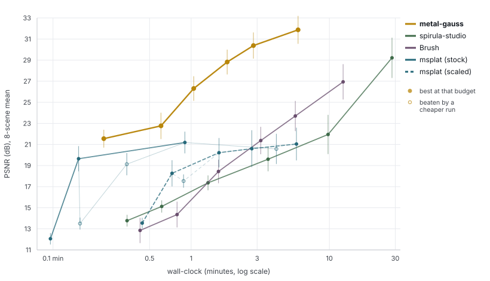
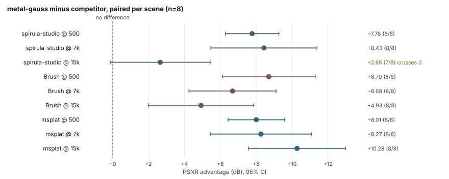

<p align="center"></p>

<p align="center"><b>3D Gaussian Splatting that trains on Apple Silicon. Metal kernels, no CUDA, no Xcode.</b></p>

<p align="center">
  
  
  
  
  
  
  
</p>

---

3D Gaussian Splatting that **trains** on Apple Silicon. Metal compute kernels compiled at runtime,
so there is no CUDA and no Xcode — Command Line Tools are enough.

## 🏆 Quality per minute

Given N minutes, what is the best reconstruction you can get? All 8 NeRF-synthetic scenes, identical
seed cloud per scene, one evaluator on the official 200-view test split, strictly sequential.

<!-- BEGIN:budget -->
| you have | metal-gauss | msplat | Brush | spirula |
|---|---:|---:|---:|---:|
| 30 s | **21.5** | 19.9 | 12.8 | 13.8 |
| 1 min | **24.2** | 20.8 | 14.4 | 15.1 |
| 3 min | **29.8** | 22.1 | 18.4 | 17.4 |
| 6 min | **31.4** | 22.3 | 23.4 | 19.6 |
| 15 min | **31.9** | 22.4 | 26.9 | 22.1 |
| 30 min | **31.9** | 22.4 | 26.9 | 28.5 |

*Best 8-scene-mean PSNR reachable without exceeding each budget; msplat takes its better variant at each point. Em dash means the implementation produces nothing within that budget on all 8 scenes. Full per-rung ladder in [docs/BENCHMARKS.md](docs/BENCHMARKS.md).*
<!-- END:budget -->



Lines trace best-achievable-by-budget. Hollow dots are measured but beaten by a cheaper run of the
same implementation. Whiskers are ±1 s.e.m. across the 8 scenes.



Paired per scene, because every implementation ran the same 8 scenes. One interval crosses zero:
our quality margin over spirula at 15 k is not resolved by 8 scenes, though the wall-clock margin
there (6.0 min vs 28.4) is not in question.

Domination (faster **and** better) on PSNR / on PSNR+SSIM:
[Brush](https://github.com/ArthurBrussee/brush) **48/48 · 48/48**,
[spirula-studio](https://github.com/harry7557558/spirula-studio) **45/48 · 41/48**,
[msplat](https://github.com/rayanht/msplat) **66/96 · 50/96**.

## ⏱️ Watch it converge

Four trainers, same seed cloud, each given the **same ~390 s**, running however many iterations fit.


| | final PSNR | first 20 dB | first 24 dB | first 27 dB |
|---|---:|---:|---:|---:|
| **metal-gauss** (15 k it) | **33.26** | 19.4 s | **57.5 s** | **147.1 s** |
| Brush (7 k it) | 24.82 | 105.6 s | 270.0 s | — |
| spirula-studio (5.5 k it) | 24.31 | 147.8 s | 371.6 s | — |
| msplat (19 k it) | 23.33 | **7.9 s** | 58.5 s | — |

lego, panel at 400 px, metrics over 20 held-out views at 800 px. Build the interactive version with
`python bench/compare/build_timelapse_page.py`.

## 📦 Install

```bash
pip install "git+https://github.com/nandometzger/metal-gauss"
```

macOS on Apple Silicon, Python ≥3.10, PyTorch ≥2.5. Metal kernels compile at **runtime** — no Xcode,
no `.metallib` step.

## 🚀 Train

```bash
metal-gauss-train --colmap scene/sparse/0 --images scene/images --steps 7000 --export scene.ply
metal-gauss-train --blender data/nerf_synthetic/lego --steps 30000
```

Every 8th view is held out. The exported `.ply` is standard INRIA-convention 3DGS. Capacity follows
the step count; `--budget` overrides it. Blender scenes are **not vendored** — unpack
[nerf_synthetic](https://github.com/bmild/nerf) into `data/nerf_synthetic/`.

## 🎥 Render

```bash
metal-gauss-render prediction.ply --out frame0.png --still --like-photo portrait.jpg
metal-gauss-render prediction.ply --out wiggle.mp4 --like-photo portrait.jpg
metal-gauss-render scene.ply --out orbit.mp4 --frame bbox --path orbit --sweep-deg 20
```

Renders an existing `.ply` along a camera path the tool generates itself, so a file is no longer tied
to the dataset it came from. Training already wrote `.ply` files, but every render path in the repo
borrowed its cameras from a dataset, which left no way to look at a checkpoint, a scene trained
elsewhere, a download, or anything a feedforward model predicted. Point this at a file and get a png
or an mp4: `--path` picks still, wiggle or orbit, `--frame` picks what that path is built around,
and `--resolution`, `--fov`, `--background` and `--convention` do what they say.

`--frame input` anchors on the predicting camera, because a monocular predictor works in the input
photograph's frame and the identity world-to-camera matrix reproduces that shot. `--frame bbox`
places the camera around the cloud instead, for a trained scene that has no input camera. The
default `auto` picks by the fraction of splats sitting in front of the origin, taking `input` above
**99%**.

`--like-photo` matters more than it looks, and it is the flag that makes a monocular prediction come
out right. A `.ply` carries no camera, but the prediction was made under one, taken from the
photograph's EXIF. Render it back at some other FOV and the geometry is right while the crop is not,
so frame 0 stops reproducing the photograph, which is the whole point of anchoring to it. Worked
example: Apple's [SHARP](https://github.com/apple/ml-sharp) reads `FocalLengthIn35mmFilm` and
converts it with `f_px = f_35mm · diag(W, H) / diag(36, 24)`; this flag reproduces that conversion
rather than approximating it, because the goal is to agree with the predictor and not to be
independently correct about the lens. Without the flag the FOV is fitted to the cloud and the tool
says so. The gap is not subtle: a 135 mm portrait is **12.9°**, SHARP's no-EXIF fallback of 30 mm
is **54°**. SHARP is also a fair test of the whole entry point, since its own video renderer
**requires CUDA** — predict on MPS, render here.

`--aperture` renders through a thin lens instead of a pinhole: the frame becomes the mean of many
views spread over the lens area, every one aimed at the focal plane, so that plane stays sharp and
everything else disperses. Defocus therefore needs no new rasteriser, only more cameras. Radius 0 is
the default and is bit-identical to the pinhole path. Below about 32 samples the sampling disc shows
as a lattice in the bokeh.

```bash
metal-gauss-render prediction.ply --out bokeh.mp4 --like-photo portrait.jpg \
    --aperture 0.03 --aperture-samples 96
```

Forward-only, so it is much faster than a training step: **69 fps** at 600k splats and 768², **91**
at 512², **481** at 100k splats and 384², on an M5 with the GPU to itself (`bench/render_fps.py`,
three round-robin repeats agreeing to within 10%). A defocused frame costs that times the sample
count.

Defaults are 60 frames at 30 fps, 512 px square, ±5° wiggle; `ffmpeg` on PATH writes the mp4.
`--still` dumps frame 0 as a `.png`, the cheap way to check a file's convention before rendering 60
frames of it; `--convention opengl` if it comes out flipped. A monocular prediction only has
evidence for what the photograph saw, so past roughly **8°** the sweep starts showing invented
surface. That is why the default sweep is small.

## ⚠️ Caveats

- msplat is **1.3–1.8× faster per step**. Our fixed startup at that end was ~8.4 s and is now
  **~3 s**: 6.1 s of it was decoding PNGs, and 4.1 s of that decoded the 200 held-out views a run
  without evaluation never reads. The budget rows above were measured before that and the
  sub-0.3 min end has not been re-run.
- 7 k numbers are **not comparable to published 30 k numbers** — 5.1 dB apart.
- `--antialias` is off by default; worth **+6.68 dB at 200 px** render resolution.
- Run-to-run noise floors: ours **0.19 dB**, Brush **0.74**, spirula **0.15–1.27**, msplat **3.35**
  (no seed flag).
- `--budget` at 1 M splats: **+2.75 dB** lego, **+1.40** mic, **−0.20** ship, all at ~5× the time.

## 📚 More

| | |
|---|---|
| [docs/BENCHMARKS.md](docs/BENCHMARKS.md) | full results, protocol, calibration, noise floors |
| [docs/ARCHITECTURE.md](docs/ARCHITECTURE.md) | how it works, the kernels, correctness oracle |
| [bench/results/NEGATIVE_RESULTS.md](bench/results/NEGATIVE_RESULTS.md) | **every rejected lever and measurement lesson, with numbers** |
| [bench/compare/STATUS.md](bench/compare/STATUS.md) | every Apple-native implementation surveyed, and the traps |

`NEGATIVE_RESULTS.md` is the most useful file here: several published speedups measure near zero on
this hardware, and several of this repo's own conclusions were wrong until re-measured.

## 📄 License

MIT. Credits: [3DGS-MCMC](https://arxiv.org/abs/2404.09591),
[Taming 3DGS](https://arxiv.org/abs/2406.15643), [Speedy-Splat](https://arxiv.org/abs/2412.00578),
[LiteGS](https://arxiv.org/abs/2503.01199), [Mip-Splatting](https://arxiv.org/abs/2311.16493),
[gsplat](https://github.com/nerfstudio-project/gsplat),
[LichtFeld Studio](https://github.com/MrNeRF/LichtFeld-Studio),
[Brush](https://github.com/ArthurBrussee/brush), and the original
[INRIA rasterizer](https://github.com/graphdeco-inria/gaussian-splatting).
